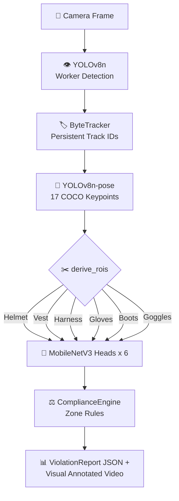

<h1 align="center">
  🏗️ Construction Site Safety Monitor
</h1>

<p align="center">
  <strong>Computer vision pipeline for construction site PPE compliance monitoring.</strong>
</p>

<p align="center">
  
  
  
  
</p>

## 📖 Overview

Detects workers ➡️ estimates pose ➡️ verifies PPE (helmet/vest/harness/gloves/boots/goggles) using **keypoint-anchored ROIs** ➡️ applies zone-based rules ➡️ generates structured violation reports.

---

## 🏗️ Architecture



### 🧠 Key Insight: Keypoint-anchored PPE verification
Instead of object detection across the entire frame, PPE is checked strictly within anatomical Regions of Interest (ROIs) derived from pose keypoints:
- 🪖 **Helmet**: ROI derived from nose + ear keypoints.
- 🦺 **Vest**: Full torso bounding box from shoulders + hips.
- 🧗 **Harness**: 40px wide diagonal bands from shoulder to hip.
- 🧤 **Gloves**: 30px radius circles around wrist keypoints.
- 🥾 **Boots**: Estimated bounding boxes anchored on ankle keypoints.
- 🥽 **Goggles**: Region cropped around eye + nose keypoints.

---

## 🚀 Prerequisites & Installation

**Prerequisites:**
- Python 3.9+
- NVIDIA GPU (optional but recommended for real-time inference)

### 💻 Local Setup
```bash
# 1. Clone the repository / initialize workspace
cd construction_safety/

# 2. Create and activate a virtual environment
python -m venv .venv
.\.venv\Scripts\Activate.ps1  # Windows
# source .venv/bin/activate   # Linux/Mac

# 3. Install dependencies
pip install -r requirements.txt
```

### ☁️ Google Colab Setup
To run inference or training in Colab:
1. Open Google Colab and select a GPU runtime (`Runtime > Change runtime type > T4 GPU`).
2. Clone the repository in a cell: `!git clone <your-repo-url> && cd construction_safety`
3. Install dependencies: `!pip install -r requirements.txt`
4. Run inference CLI commands or open `train.ipynb` to execute the pipeline.

---

## 🏃‍♂️ Standalone Inference (CLI)

Run end-to-end evaluation on videos or images locally.

```bash
# Single image inference
python run_inference.py --input D:/Construction/YoloDataset/images/test/image1.jpg

# Video file inference (generates annotated output video)
python run_inference.py --input D:/Construction/Construction.mp4 --video        

# Inference with specific zone rules applied
python run_inference.py --input image.jpg --zone elevated_zone
```

---

## 🤖 Models Used

| Model | Purpose | Why |
|:---:|:---|:---|
| **YOLOv8n** | Person/worker detection | Fast, accurate, production-proven at real-time speeds (25+ FPS). |
| **YOLOv8n-pose** | 17 COCO keypoint estimation | Enables highly precise, anatomical ROI derivation. |
| **MobileNetV3-Small** | 6x PPE classification heads | Extremely lightweight classifiers with excellent transfer learning. |
| **ByteTracker** | Multi-object tracking | Maintains persistent worker IDs across complex video frames. |

---

## 🎓 Training Pipeline

All training steps (data prep, YOLOv8 fine-tuning, and MobileNetV3 head training) are contained within the `train.ipynb` Jupyter Notebook.

1. Open `train.ipynb` in your Notebook environment.
2. Run data engineering cells to process the dataset and generate Ground Truth crops.
3. Train the MobileNetV3 classification heads.
4. Export weights to the `models/` directory for immediate inference.

---


## ⚖️ Evaluation & Limitations

### 🎯 Key Design Decisions
- **Two-Stage Cascade Architecture**: Instead of training a monolithic object detector to find thousands of tiny PPE objects, we chose a pose-driven cascade. YOLOv8n detects workers and pose keypoints, while hyper-lightweight MobileNetV3 classifiers verify specific PPE within those keypoints. This prevents class imbalance and allows easy addition of new PPE types.
- **Benefit-of-the-Doubt Compliance**: If a worker's body part is occluded (resulting in a degenerate coordinate crop), the system gracefully registers an "unknown" status rather than immediately triggering a false positive violation.

### 🔍 Honest Evaluation
**Where the model performs well:**
- **Clear Line of Sight**: Exceptional accuracy when workers are somewhat unobstructed and upright in medium-to-close shots.
- **Speed**: The combination of Nano-YOLO and MobileNetV3 allows the pipeline to run efficiently at high frame rates, even on modest hardware.

**Where it struggles (Known Limitations):**
- **Dense Crowds & Extreme Occlusions**: If workers overlap heavily, ByteTracker can lose IDs, and YOLO-pose estimates can warp, leading to inaccurate ROI crops (e.g., evaluating Worker A's vest using Worker B's keypoints).
- **Distant Subjects**: Tiny worker representations yield pixel-starved anatomical crops (e.g., 2x2 pixels for boots), which causes the MobileNet classifiers to drop in reliability.
- **Harness Detection**: Safety harnesses blend easily with high-vis vests and lack solid boundaries. Relying on diagonal shoulder-to-hip interpolation is noisy, making it the most challenging PPE item to verify.

---

## 📂 Project Structure

```text
construction_safety/
├── requirements.txt            <- Python dependencies
├── pytest.ini                  <- Unit test configuration
├── README.md                   <- This documentation file
├── run_inference.py            <- CLI entrypoint for pipeline execution
├── src/
│   ├── config.py               <- System configurations, paths, thresholds
│   ├── models/
│   │   ├── detector.py         <- YOLOv8 worker detection module
│   │   ├── pose.py             <- YOLOv8 pose & ROI module
│   │   ├── ppe_heads.py        <- MobileNetV3 classification
│   │   └── tracker.py          <- ByteTracker integration
│   ├── pipeline/
│   │   ├── inference.py        <- End-to-end orchestrator
│   │   ├── compliance.py       <- Business logic & violations
│   │   ├── zones.py            <- Zone management routines
│   │   └── reporter.py         <- Output standardization
│   └── utils/
│       ├── drawing.py          <- OpenCV visual annotation hooks
│       └── video.py            <- Efficient frame extraction/writing
└── tests/
    ├── test_pipeline.py        <- Inference & architectural unit tests
    └── test_compliance.py      <- Business logic unit tests
```
